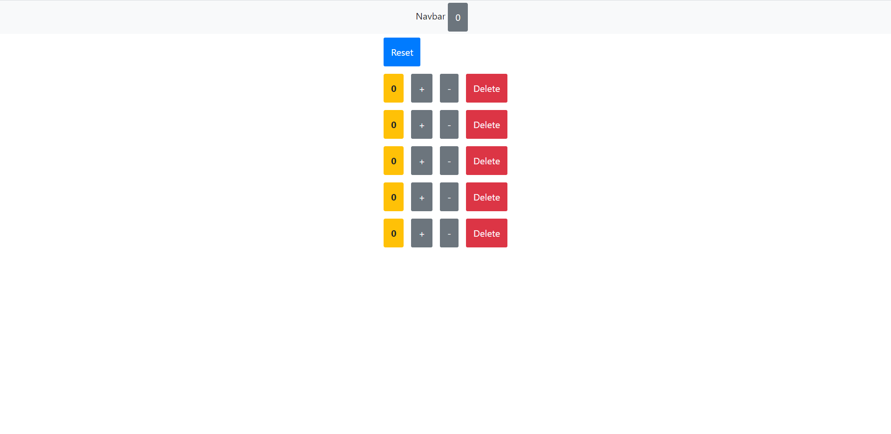

# counter

A counter made with React and Bootstrap with functionality that resembles a shopping cart in an e-commerce page for example. 
  
 

## Built With
- JavaScript (React.Js)
- Bootstrap

## Live Demo

[Live Demo Link](https://ceci007.github.io/counter/)

## Author
- Cecilia Benitez
- 👤GitHub: https://github.com/Ceci007

## Show your support
Give a ⭐️ if you like this project!

## Acknowledgments
- Inspiration
Appreciate Mosh Hamedani for his blog tutorial, who help me to create this project.
